# Model App

AI-assisted data modeling app for Databricks; part of the Databricks industry
data models initiative. It is a Databricks App control plane (React + FastAPI)
for generating, iterating on, and deploying business data models to Unity
Catalog.

## Contents

- [What the app does](#what-the-app-does)
- [Installing in your workspace](#installing-in-your-workspace)
- [What's here](#whats-here)
- [Local development](#local-development)
- [Publishing to GitHub (optional)](#publishing-to-github-optional)
- [Related](#related)

## What the app does

Model Foundry (the app's product name) is a graphical front-end to the Vibe Data
Modeling agent. It takes you from a plain-English description of a business to a
governed, versioned data model deployed to Unity Catalog, iterating in natural
language, with no notebook required.

The app covers modeling and deployment of the model - designing the schema,
iterating on it, and materializing it to Unity Catalog. It does not integrate the
model onto real data. Forming a model onto existing data is a separate process
(the `model-genie-skills` data-integration flow) and is out of scope here.

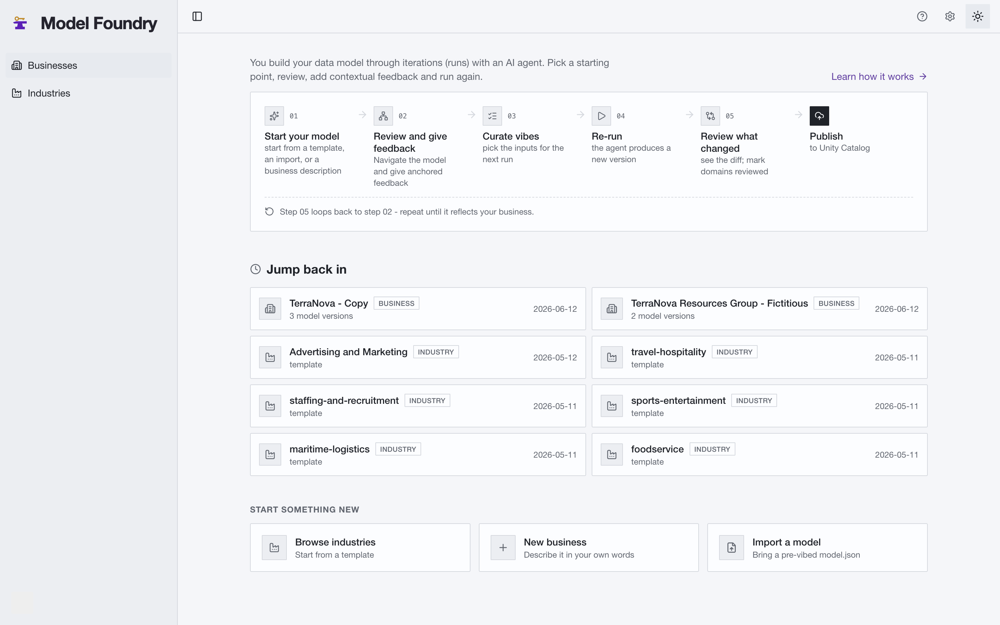

The home page lays out the loop and lists your recent businesses alongside the
built-in industry templates.

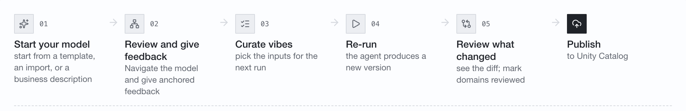

The workflow strip on the landing page names the loop end to end: **01 Start your
model** (from a template, an import, or a business description) - **02 Review and
give feedback** (navigate the model and give anchored feedback) - **03 Curate
vibes** (pick the inputs for the next run) - **04 Re-run** (the agent produces a
new version) - **05 Review what changed** (see the diff; mark domains reviewed) -
**Publish** (to Unity Catalog).

### 1. Start a model

Start from an industry template, import an existing `model.json`, or describe a
business in your own words. The agent generates a base model (version 1) from that
starting point. For how to write a good business description, see
[Describing a business](docs/Describing-a-business.md).

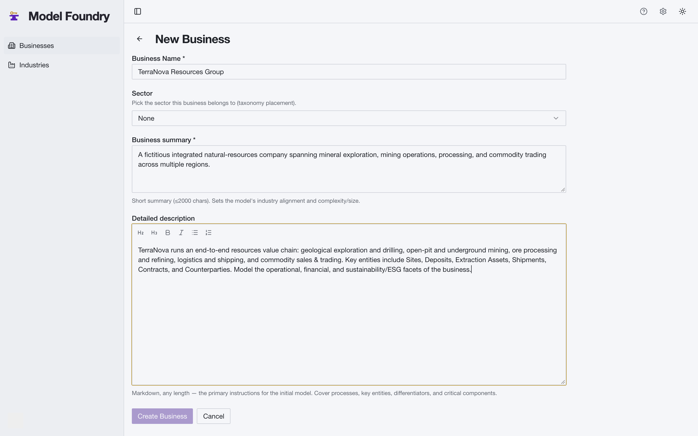

### 2. Explore the model

Every version is navigable from several angles. The **diagram** renders the
entity-relationship graph. To keep it readable, the shot below shows a single
domain (`customer`) in **Show keys (PK/FK)** mode: its 15 tables with their
primary and foreign keys and the foreign-key edges between them, colored by table
category (master, transactional, reference, association). The other domains are
hidden.

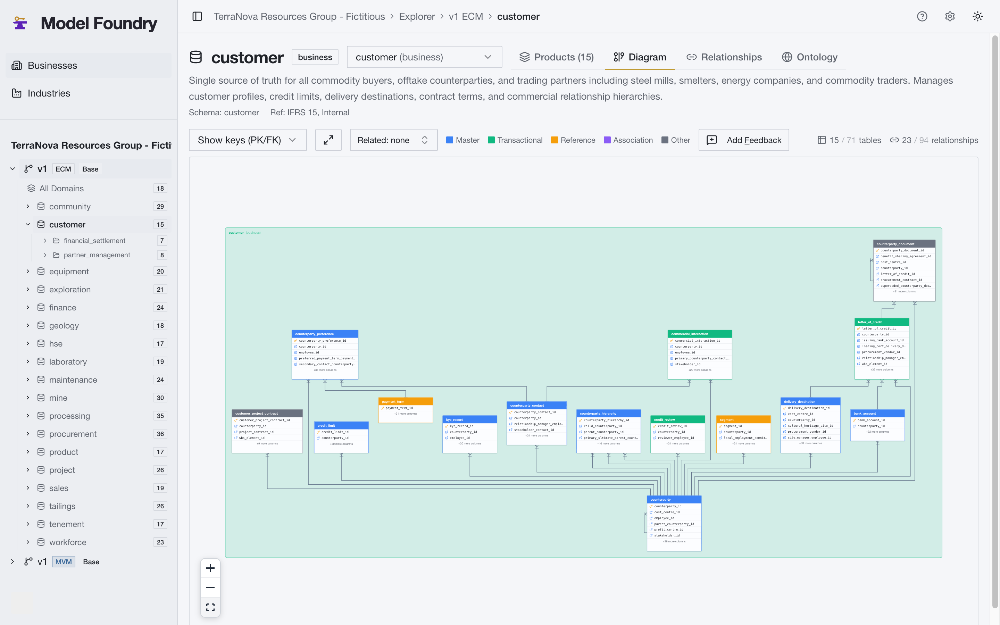

The **ontology** view shows the same `customer` domain as a force-directed graph,
in **Intra-Domain Only** scope. Each node is an entity, sized by its foreign-key
count and colored by category, with edges for the relationships between them.

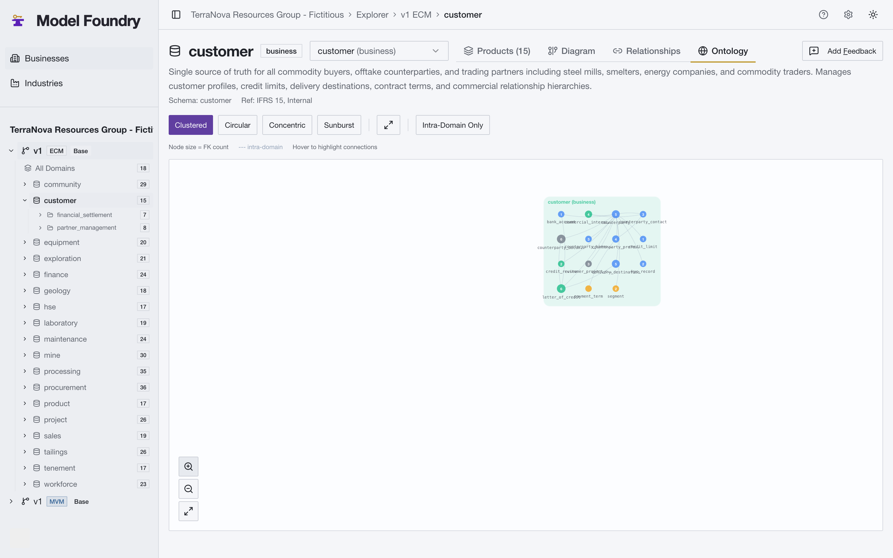

The **explorer** starts at the all-domains top view. The size panel summarizes the
whole model at a glance - here 18 domains, 61 subdomains, 416 products, 15,002
columns, and 2,458 foreign keys - above a card per domain.

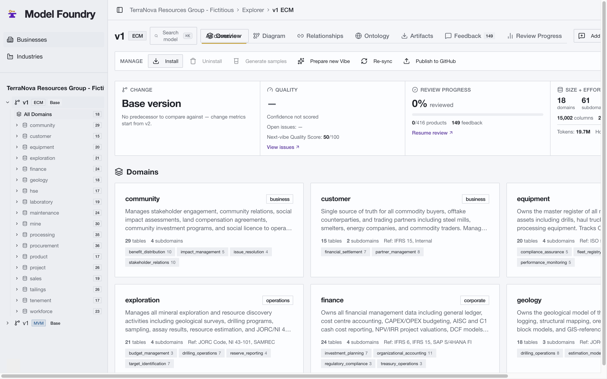

From there you drill into a single domain - its sub-domains, products (tables),
attributes, primary keys, and foreign keys.

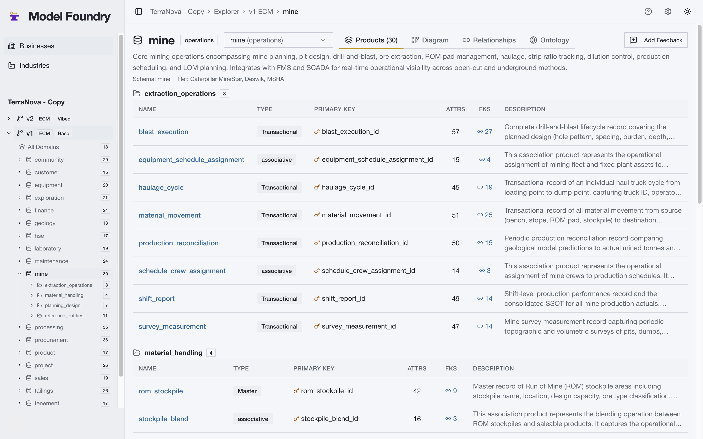

### 3. Review and give anchored feedback

The review surface summarises quality (a computed confidence and quality score,
plus open issues), what changed versus the previous version, and where to focus
next. You mark domains reviewed and attach feedback anchored to specific elements
of the model, rather than losing it in a chat log.

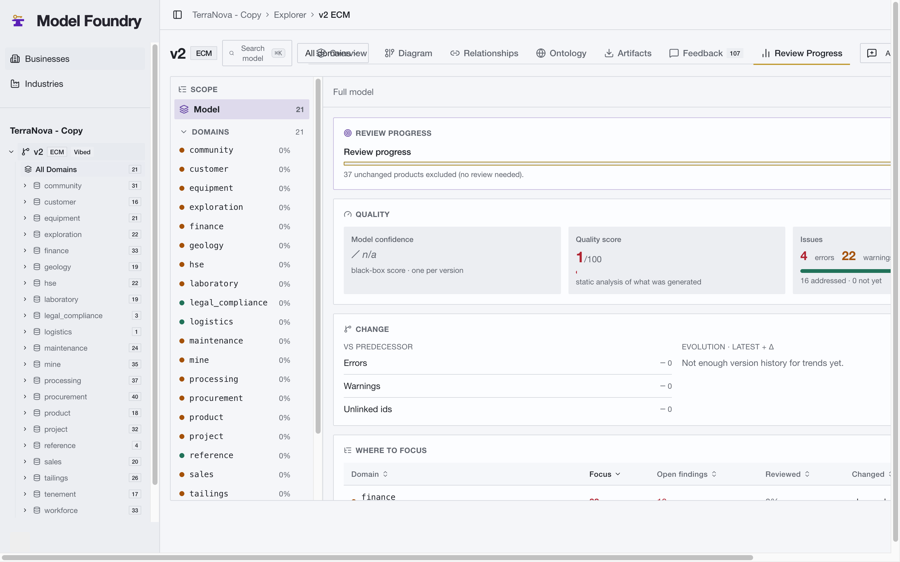

To add feedback, navigate to the context you want to change - a domain, a table,
or a relationship in the diagram view - then open the **Add feedback** box in that
context. The box shows the anchor as chips (here `view: diagram`, `domain:
customer`, `table: customer.counterparty`), a text input for the change you want,
and a Priority selector, with Save and Cancel. Because the feedback is anchored to
that element, the agent knows exactly what it refers to on the next run.

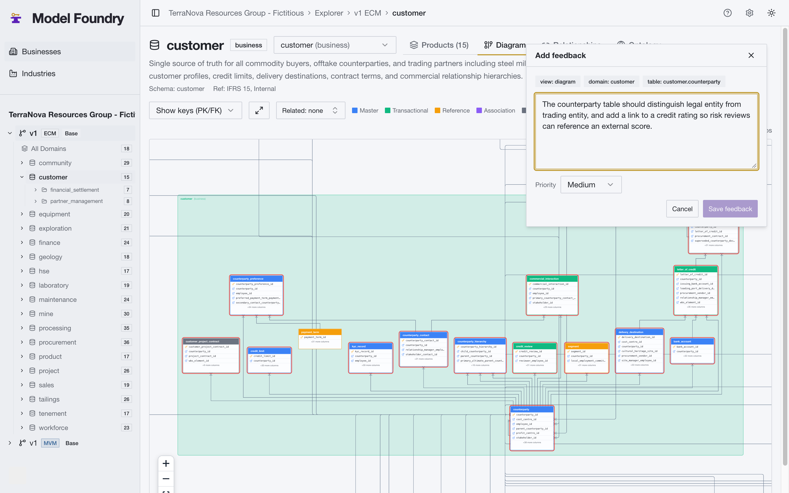

### 4. Curate the next run's inputs

All feedback is always viewable in the **Feedback** tab. You can add, edit, and
remove feedback at any point in the review, curate, and re-run cycle - not only
before a run.

When you compose the next run, you pick exactly which feedback and agent-suggested
changes go in. Filters at the top of the curate surface narrow the list - for
example by the state of an item, its source, and its priority - so you can focus
the selection. The app compiles what you pick into the instructions the agent will
act on.

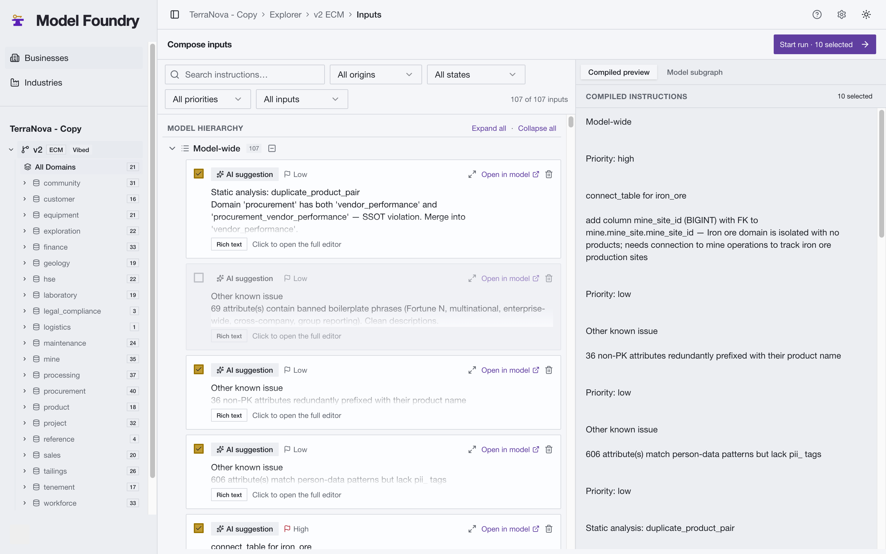

### 5. Re-run and see what changed

Runs are launched from the **New Run** screen. You pick the **Operation Type**
(here **Vibe Modeling**), the base version, and the vibe inputs, and can expand
**Advanced Options** to tune the run - **Organization** (divisions and business
domains), **Namespace style** (the catalog/schema prefix and suffix), and
**Naming & format**. A **Compiled instructions preview** on the right shows exactly
what the agent will receive.

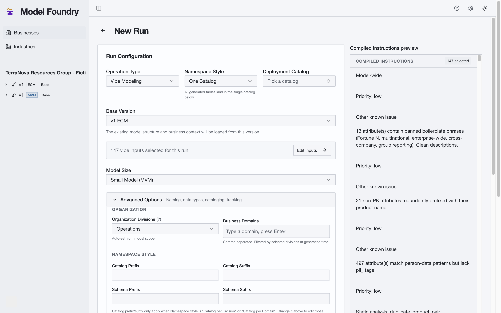

The operation types are:

- **New base model** - generate a fresh model (version 1) from a business
  description or template.
- **Vibe modeling of version** - apply natural-language feedback to an existing
  version and produce the next version.
- **Shrink ECM** - reduce the enterprise conceptual model to a smaller scope.
- **Enlarge MVM** - expand the minimum viable model with more detail or coverage.
- **Install model** - deploy an existing version to Unity Catalog.
- **Uninstall model version** - remove a previously installed version from Unity
  Catalog.

Each model-producing run produces a new, complete version - the previous one is
never overwritten. The version tree keeps every iteration, and each vibed version
shows a diff against its predecessor: what was added, changed, and removed, and
how much of the model was touched.

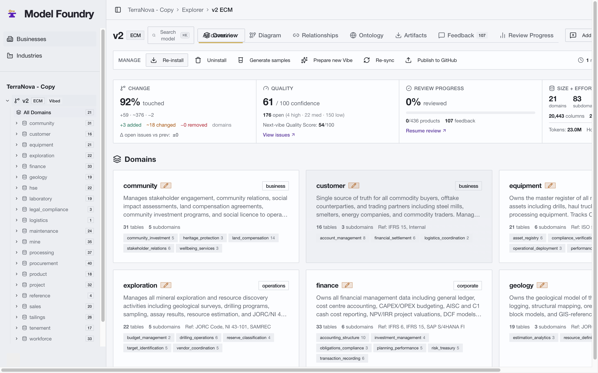

The **Run details** page shows what happened. The example below is a completed
run: the progress bar reads 100% with the elapsed time (hh:mm:ss), **Lineage**
records the source and generated versions (here v1 ECM into v2 ECM), and the
expanded **Phase 1 - vibe_iterate** section lists each step (Setup, Interpreting
Instructions, Logical Schema Generation, QA, Model Finalization, FK Integrity
Gates, Next Vibes Generation).

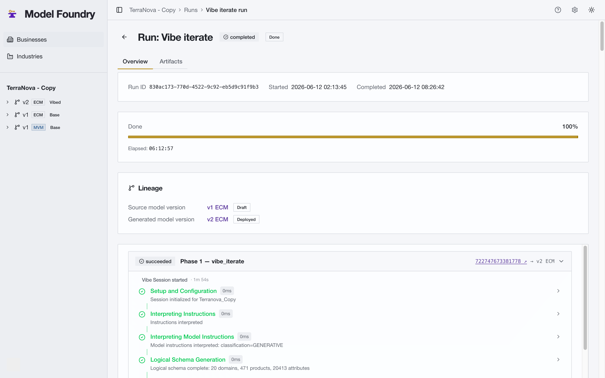

Each step is expandable, so you can focus on the one you care about, and a link
takes you straight to the underlying Databricks job run for the low-level logs. A
run normally takes from a few to many **hours**, depending on the size of the
inputs and the size of the base model.

**Caution: many operation types destroy the schemas in the target catalog and
re-materialize them.** Before it does this, the app shows a warning so you can
proceed or cancel. To avoid clobbering a pre-existing deployment, point the run at
an empty catalog, or set the **Namespace style** advanced options (a catalog
prefix and/or suffix) on the New Run screen - these change the target catalog name
so the run lands under a distinct catalog.

### 6. Deploy to Unity Catalog

Steps 2 through 5 are the iterate loop: explore, review, curate, and re-run in
natural language until the model reflects your business. Deploying to Unity Catalog
is the terminal step. A deployed version becomes schemas, tables, foreign keys,
governance tags, and metric views - with optional referentially-correct sample
data - straight from the app.

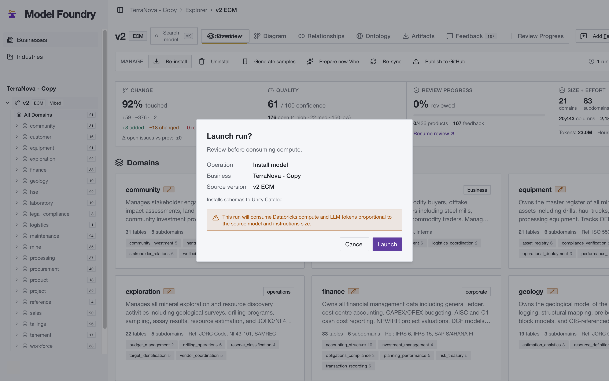

Several operations carry an **implicit deployment**: the model-producing operations
(new base model, vibe modeling of version, shrink ECM, enlarge MVM) materialize the
result to Unity Catalog as part of the run. **Install model** is the explicit deploy
of an existing version. **Uninstall model version** removes a version from Unity
Catalog.

Under the hood the agent runs a two-step, LLM-driven process. The base model seeds
the schema from a business context (business info, model conventions, optional vibe
instructions), decomposing Organization into Divisions, Domains, Products (tables),
and Attributes (columns), linking tables, enforcing a DAG constraint on foreign
keys, and running quality checks. Vibe modeling then classifies each natural-language
request into one of three modes - **surgical** (fix specific things, leave the rest
alone), **holistic** (apply a rule everywhere, preserve structure), or **generative**
(create or rebuild parts) - and re-validates through the same quality pipeline. Each
version also carries an RDFS ontology alongside the physical schema.

## Installing in your workspace

See **[INSTALL.md](INSTALL.md)** for end-to-end install instructions on any
Databricks workspace (AWS or Azure). High-level flow:

```bash
# From this directory (model-app/), on a pre-authenticated CLI profile:
bash install/install.sh \
  --profile      <your-profile> \
  --app-name     vibe-modeling  \
  --project      vibe-modeling  \
  --catalog      vibe_modeling  \
  --warehouse-id <sql-warehouse-id>
```

The installer deploys the bundle, provisions Lakebase, grants the Unity Catalog
privileges the app needs, starts the app, and pushes the built source. It is
idempotent. Lakebase is generally available on both AWS and Azure, so no preview
enrollment is needed.

By default every user granted Databricks Apps access is treated as an app admin;
set `VIBE_MODELING_RBAC_ENABLED=true` for group-based roles. See the
[Access model](INSTALL.md#access-model) section of INSTALL.md.

## What's here

| Path | Description |
|------|-------------|
| `src/app/` | The Databricks App: React + FastAPI control plane, built with [`apx`](https://github.com/databricks-solutions/apx) |
| `src/app/src/vibe_modeling/backend/` | FastAPI backend (routes, run orchestration, model export, Unity Catalog integration) |
| `src/app/src/vibe_modeling/ui/` | React + TypeScript frontend and its `__tests__` |
| `src/app/vendored/agent/` | The bundled modeling agent notebook (`VERSIONS.json` + notebook), uploaded to the workspace on first boot |
| `install/` | Installer scripts (`install.sh`, Lakebase provisioning, catalog grants, build/render) |
| `examples/` | Example model outputs (NCDOT) and a business context input (`examples/maf.json`) |
| `tests/test_app/` | App backend test suite (no Spark or workspace required) |
| `databricks.yml`, `src/app/app.yml` | Databricks Asset Bundle and App configuration |

## Local development

The app is built with [`apx`](https://github.com/databricks-solutions/apx)
(Python + FastAPI backend, React + shadcn/ui frontend). See
[CONTRIBUTING.md](CONTRIBUTING.md) for setup and the checks a change must pass.

```bash
# Backend tests (from this directory)
pytest tests/test_app

# Frontend type-check and unit tests (from src/app)
cd src/app
npx tsc --noEmit
npx vitest run
```

## Publishing to GitHub (optional)

The app can publish a model version to a GitHub repository as a pull request.
This is optional and off by default. See
[docs/github-integration-setup.md](docs/github-integration-setup.md) and the
"Enabling publish-to-GitHub" section of [INSTALL.md](INSTALL.md).

## Related

- **Industry models repository**: [databricks-industry-solutions/lakehouse-industry-data-models](https://github.com/databricks-industry-solutions/lakehouse-industry-data-models)
  - reference industry data models for customers, deployable via Databricks
  Asset Bundles. Models there may be generated and maintained with this app, but
  it is an independent resource.
- **Excel template**: a standardized spreadsheet that auto-generates README,
  JSON, DDL statements, tags, comments, and ontology - a primary input format
  for contributing industry models.
